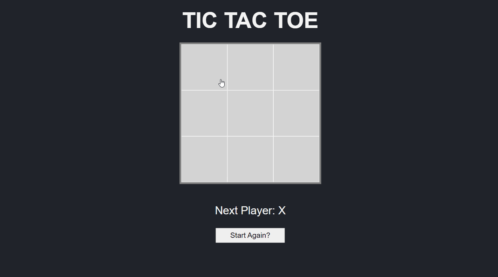

# React Tic Tac Toe

## ℹ About

Classic Tic Tac Toe game where two users can take it in turns to mark squares on a 3x3 grid with the goal to get three squares in a row.

## 💡Learning Outcome

To practise React concepts including functional conponents, state and hooks.
Styling has been done in a seperate css file rather than styled components for simplicity.

## 🎥 Finished product

## 📋 References

This project was built with reference to:

- [React docs tutorial](https://reactjs.org/tutorial/tutorial.html)
- [Build Tic Tac Toe with React Hooks by Thomas Weibenfalk](https://scrimba.com/learn/reactgame)